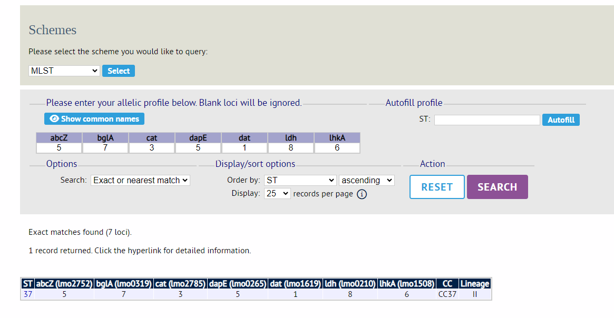
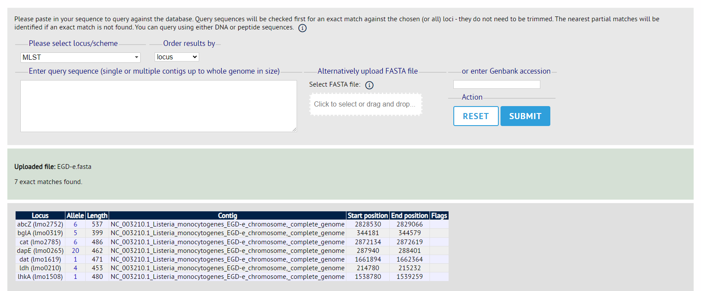

# Multi-locus Sequencing Typing

[mlst](https://github.com/tseemann/mlst) is a great tool for rapid sequencing typing of assembled libraries. 

The scripts herein assume a directory of pre-assembled genomes (using shovill) which is described in the [preprocessing document](Post-sequencing_processing.md)

mlst is easily invoked, as below:

```bash
for file1 in *.fasta; do
    mlst *.fasta > mlst_out
done
```
The benefit of not including a genus is that this is a rapid way to identify contaminants. 
However, that of course relies on the contaminant having its own MLST scheme available through the package or having no target genome housekeeping genes to detect, so should **not** be used in place of other taxonomic characterisation tools! 

Of course, if you want to include a genus you may do so:
```bash
mlst --scheme listeria *.fasta > mlst_out
```

For ambiguities, individual assemblies were manually uploaded to [BIGSdb-Lm](https://bigsdb.pasteur.fr/listeria/) and screened. 

The two easiest approaches are (a) upload the profile identified by MLST to _allelic profile_ or (b) by uploading the fasta file to _single sequence query_

Allelic profile:
<div align="center">
  
</div>

Single sequence query:
<div align="center">
  
</div>
